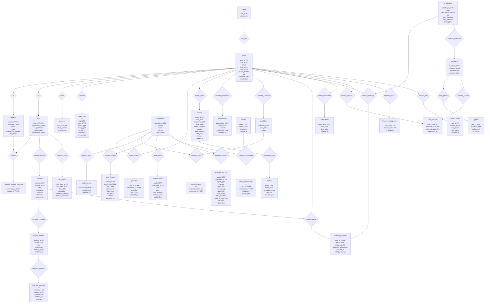

```mermaid
flowchart TB

%% ======================
%% ENTITIES
%% ======================

roles["roles
---
role_id PK
role_name"]

users["users
---
user_id PK
role_id FK
email
first_name
last_name
phone_number
dob
password_hash
created_at"]

students["students
---
user_id PK FK
institution_name
grade
major
institute_roll_number
skill_points"]

staff["staff
---
user_id PK FK
organisation_name
department
designation
experience_years"]

accounts["accounts
---
user_id PK FK
virtual_balance
created_at"]

audit_logs["audit_logs
---
log_id PK
user_id FK
action_type
entity_type
entity_id
description
created_at"]

instructor_student_mapping["instructor_student_mapping
---
instructor_id PK FK
student_id PK FK"]

instruments["instruments
---
instrument_id PK
symbol
name
sector
exchange"]

market_prices["market_prices
---
instrument_id PK FK
recent_price
updated_at"]

market_depth["market_depth
---
depth_id PK
instrument_id FK
side
price
total_quantity
orders_count
updated_at"]

price_history["price_history
---
history_id PK
instrument_id FK
open_price
close_price
high_price
low_price
volume
recorded_at"]

portfolio["portfolio
---
user_id PK FK
instrument_id PK FK
quantity
avg_price
updated_at"]

orders["orders
---
order_id PK
user_id FK
instrument_id FK
order_type
order_category
quantity
filled_quantity
limit_price
status
created_at"]

trades["trades
---
trade_id PK
order_id FK
execution_price
quantity
executed_at"]

transactions["transactions
---
transaction_id PK
user_id FK
amount
transaction_type
created_at"]

watchlists["watchlists
---
watchlist_id PK
user_id FK
name"]

watchlist_items["watchlist_items
---
watchlist_id PK FK
instrument_id PK FK"]

indices["indices
---
index_id PK
index_name
description
created_at"]

index_constituents["index_constituents
---
index_id PK FK
instrument_id PK FK
weightage
added_date"]

financial_reports["financial_reports
---
report_id PK
instrument_id FK
report_type
revenue
profit_loss
market_cap
total_debt
total_assets
total_liabilities
r_and_d_investment
dividends
report_date"]

courses["courses
---
course_id PK
provider_id FK
title
description
duration
difficulty
created_at"]

course_modules["course_modules
---
module_id PK
course_id FK
title
description
module_order
updated_at"]

learning_materials["learning_materials
---
material_id PK
module_id FK
material_type
content_url
duration"]

learning_progress["learning_progress
---
user_id PK FK
entity_id PK
entity_type PK
progress_percentage
enrolled_at
rating_out_of_5"]

live_classes["live_classes
---
live_class_id PK
instructor_id FK
class_title
description
schedule_datetime
duration_expected"]

notifications["notifications
---
notification_id PK
user_id FK
description
created_at"]

challenges["challenges
---
challenge_id PK
level
skill_points_reward
title
start_datetime
end_datetime
description"]

questions["questions
---
question_id PK
challenge_id FK
question_text
question_type"]

options["options
---
option_id PK
question_id FK
option_text
is_correct"]

user_answers["user_answers
---
user_id PK FK
question_id PK FK
selected_option FK
submitted_at"]

feature_management["feature_management
---
user_id PK FK
feature_name PK
is_enabled"]

system_rules["system_rules
---
rule_id PK
created_by FK
rule_name
rule_value
created_at"]


%% ======================
%% USER MANAGEMENT RELATIONSHIPS
%% ======================

has_role{has_role}
is_student{is}
is_staff{is}
owns_account{owns}
logs_action{records}
mentors{mentors}

roles --> has_role
has_role --> users

users --> is_student
is_student --> students

users --> is_staff
is_staff --> staff

users --> owns_account
owns_account --> accounts

users --> logs_action
logs_action --> audit_logs

staff --> mentors
students --> mentors
mentors --> instructor_student_mapping


%% ======================
%% TRADING RELATIONSHIPS
%% ======================

owns_position{owns_position}
places_order{places_order}
generates_trade{generates_trade}
records_transaction{records_transaction}
creates_watchlist{creates_watchlist}
contains_item{contains_item}

users --> owns_position
instruments --> owns_position
owns_position --> portfolio

users --> places_order
places_order --> orders

orders --> generates_trade
generates_trade --> trades

users --> records_transaction
records_transaction --> transactions

users --> creates_watchlist
creates_watchlist --> watchlists

watchlists --> contains_item
instruments --> contains_item
contains_item --> watchlist_items


%% ======================
%% MARKET DATA RELATIONSHIPS
%% ======================

updates_price{updates_price}
records_history{records_history}
order_book{order_book}
contains_instrument{contains_instrument}
publishes_reports{publishes_reports}

instruments --> updates_price
updates_price --> market_prices

instruments --> records_history
records_history --> price_history

instruments --> order_book
order_book --> market_depth

indices --> contains_instrument
instruments --> contains_instrument
contains_instrument --> index_constituents

instruments --> publishes_reports
publishes_reports --> financial_reports


%% ======================
%% LEARNING RELATIONSHIPS
%% ======================

creates_course{creates_course}
contains_modules{contains_modules}
contains_materials{contains_materials}
tracks_progress_course{tracks_course}
tracks_progress_challenge{tracks_challenge}

staff --> creates_course
creates_course --> courses

courses --> contains_modules
contains_modules --> course_modules

course_modules --> contains_materials
contains_materials --> learning_materials

users --> tracks_progress_course
courses --> tracks_progress_course
tracks_progress_course --> learning_progress

users --> tracks_progress_challenge
challenges --> tracks_progress_challenge
tracks_progress_challenge --> learning_progress


%% ======================
%% LIVE EDUCATION
%% ======================

conducts_class{conducts_class}
sends_notification{sends_notification}

staff --> conducts_class
conducts_class --> live_classes

users --> sends_notification
sends_notification --> notifications


%% ======================
%% CHALLENGE RELATIONSHIPS
%% ======================

contains_questions{contains_questions}
has_options{has_options}
records_answer{records_answer}
submits_answer{submits_answer}

challenges --> contains_questions
contains_questions --> questions

questions --> has_options
has_options --> options

questions --> records_answer
records_answer --> user_answers

users --> submits_answer
submits_answer --> user_answers


%% ======================
%% PLATFORM MANAGEMENT
%% ======================

controls_feature{controls_feature}
creates_rule{creates_rule}

users --> controls_feature
controls_feature --> feature_management

users --> creates_rule
creates_rule --> system_rules
```
