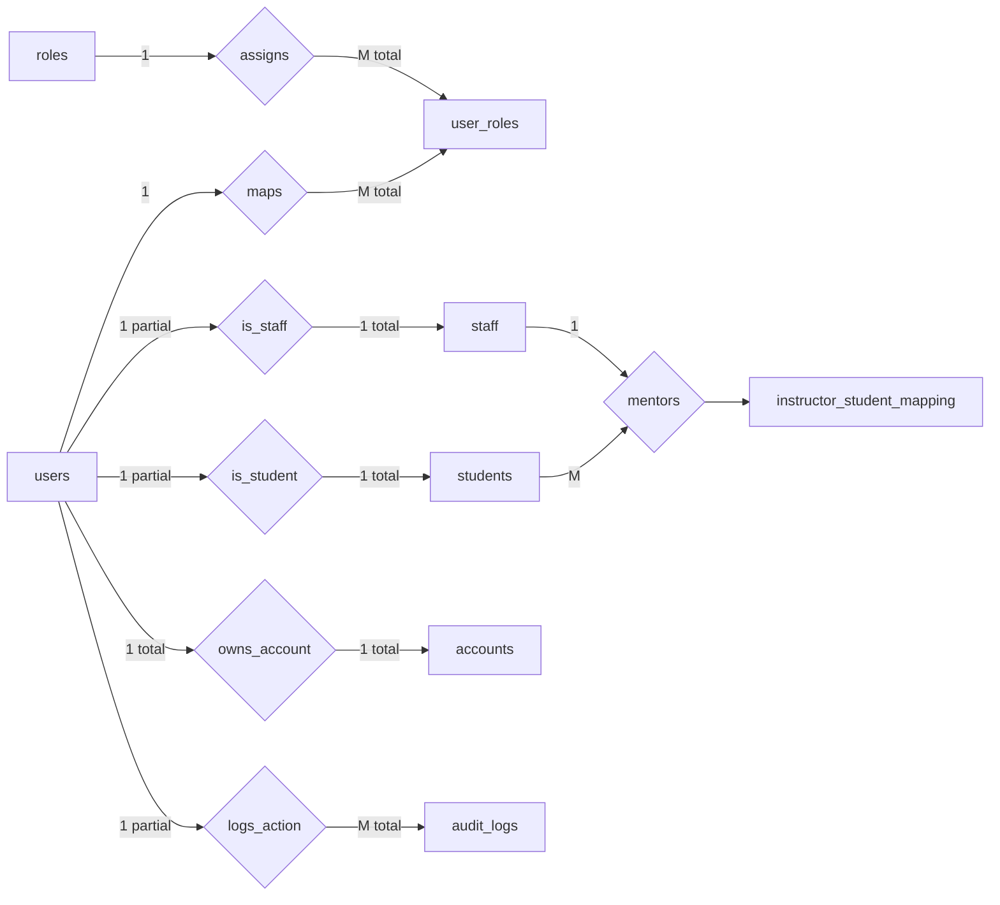
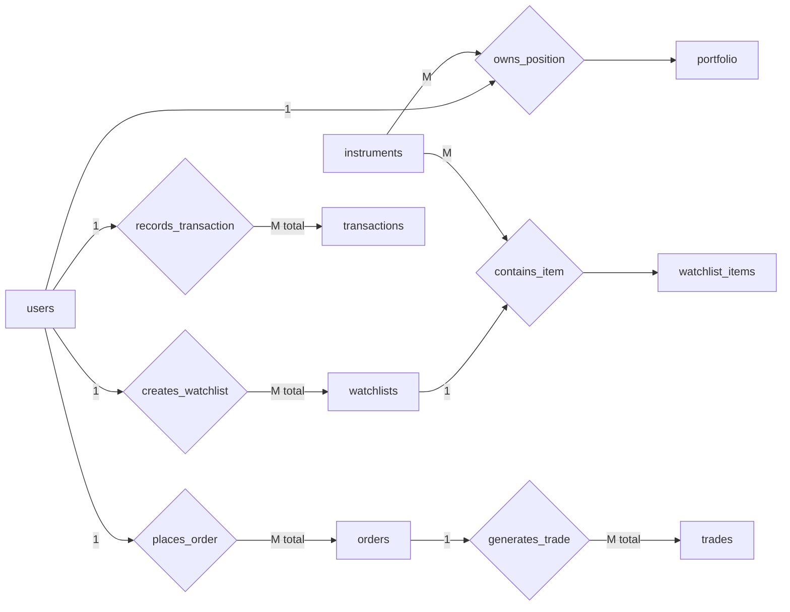
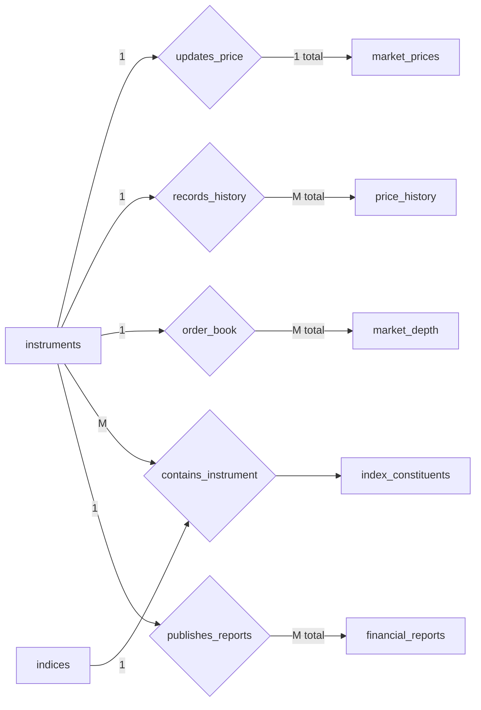
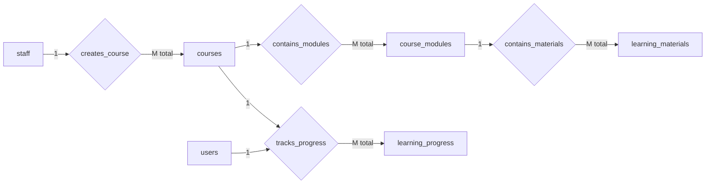
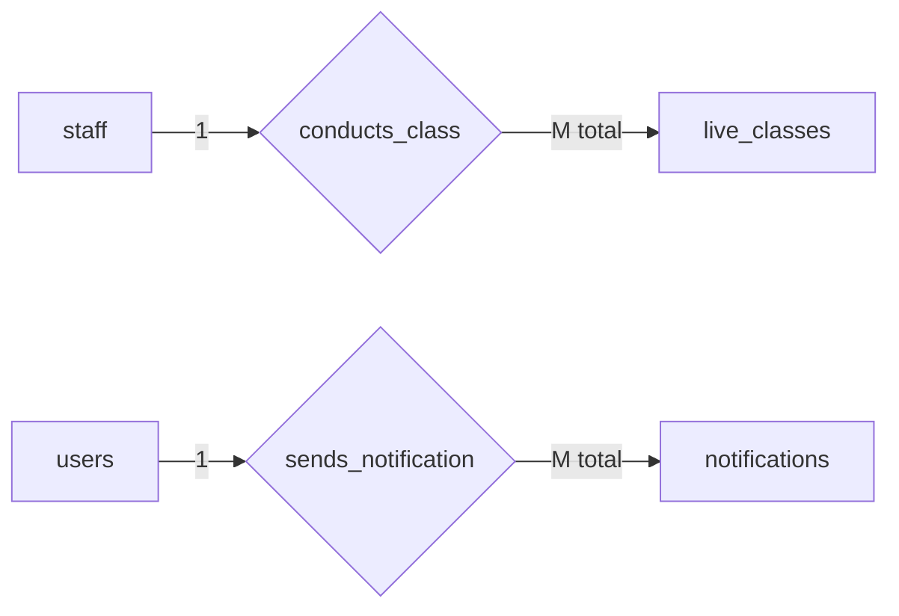
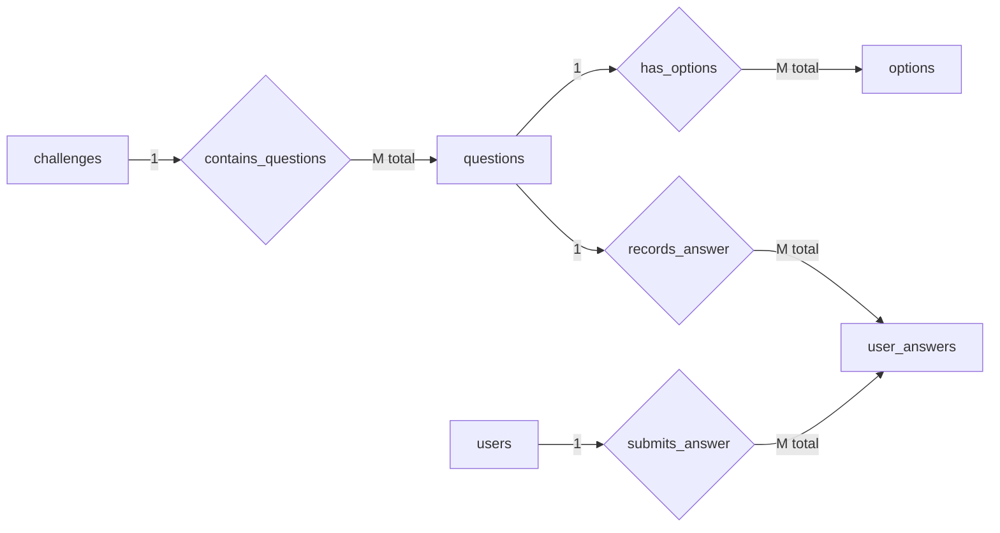
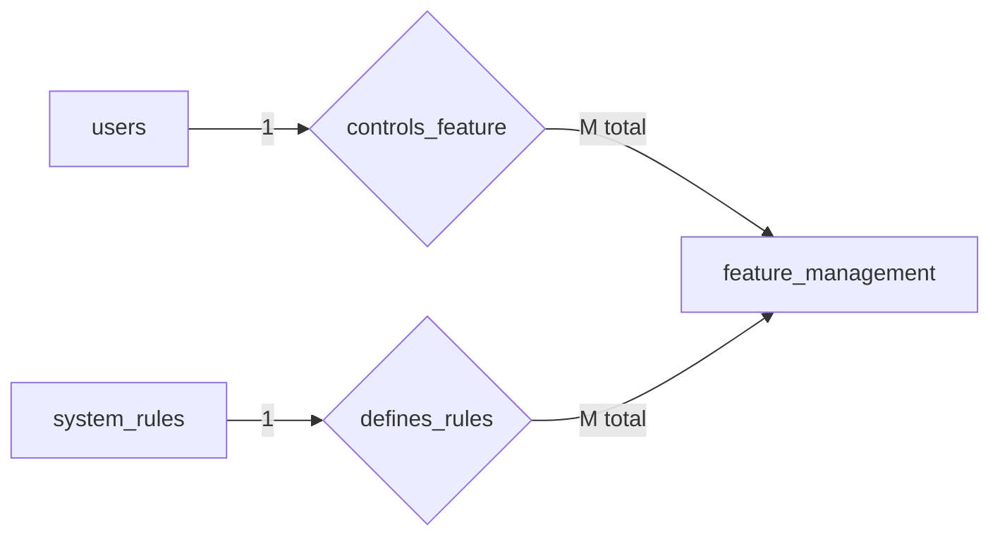
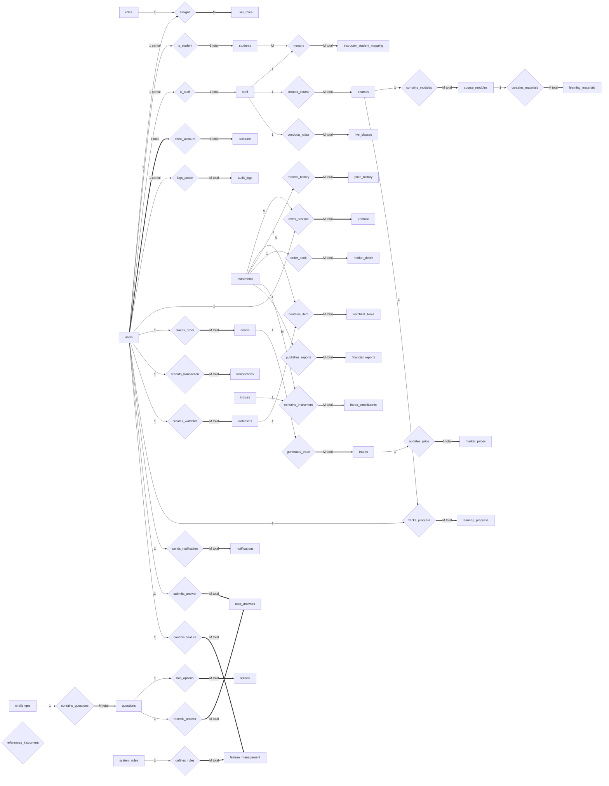

# Database ER Diagrams

This document shows the entity-relationship structure of the platform database.

Notation used:

- **1** → one entity  
- **M** → many entities  
- **total** → total participation  
- **partial** → partial participation  

---

# 1️⃣ User Management Module

---

# 2️⃣ Trading Module

---

# 3️⃣ Market Data Module

---

# 4️⃣ Learning Module

---

# 5️⃣ Live Education Module

---

# 6️⃣ Challenge Module

---

# 7️⃣ Platform Management Module

---

# Full System ER Diagram

Notation:

- `1` → one  
- `M` → many  
- `==>` → total participation  
- `-->` → partial participation  

# ER Concepts Demonstrated

This schema includes several core ER-model concepts:

| Concept | Example |
|------|------|
1:1 relationship | users ↔ accounts |
1:M relationship | users → orders |
M:N relationship | users ↔ roles |
Weak entities | students, staff |
Associative entities | user_roles, portfolio |
Specialization | users → students/staff |
Composite keys | portfolio, watchlist_items |
Polymorphic relation | learning_progress |
