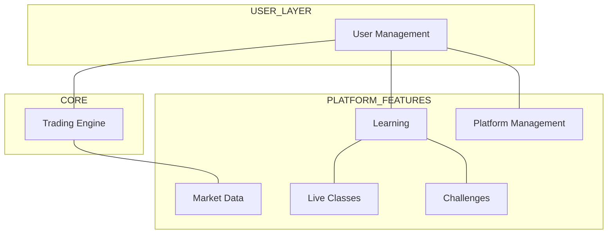
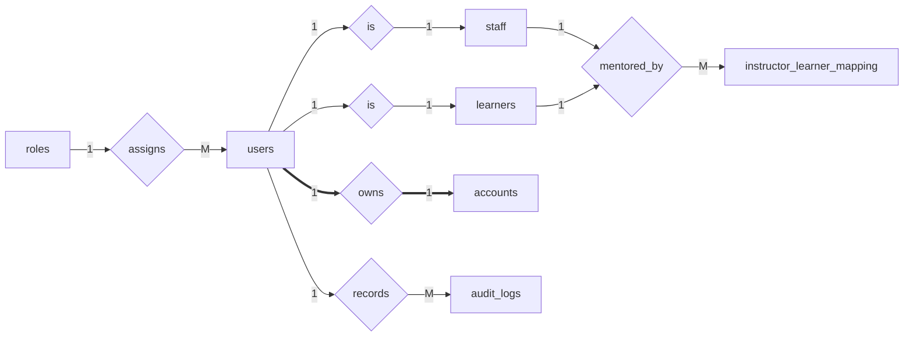
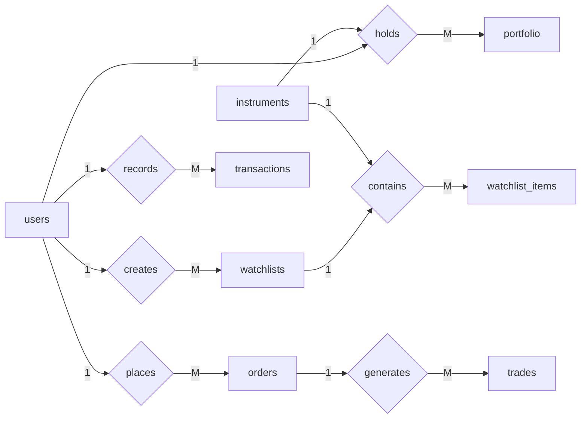
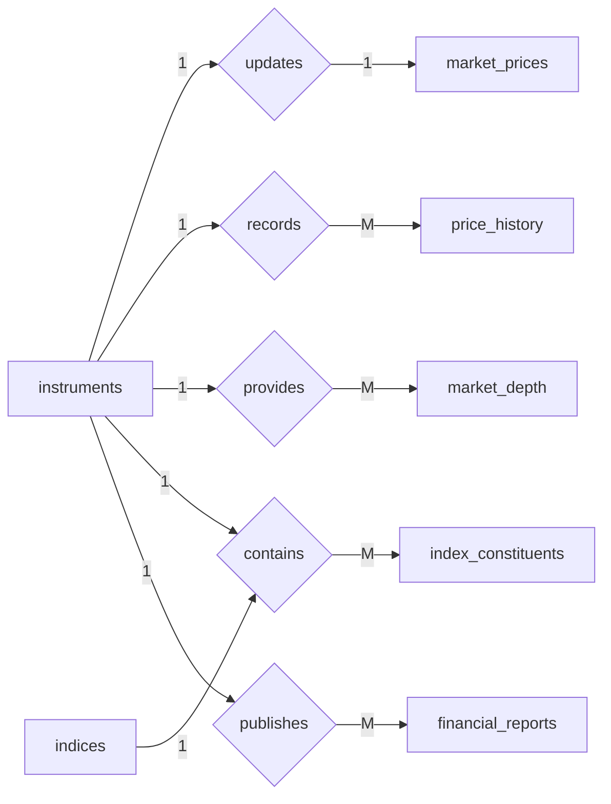
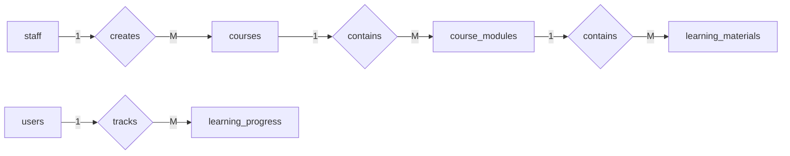
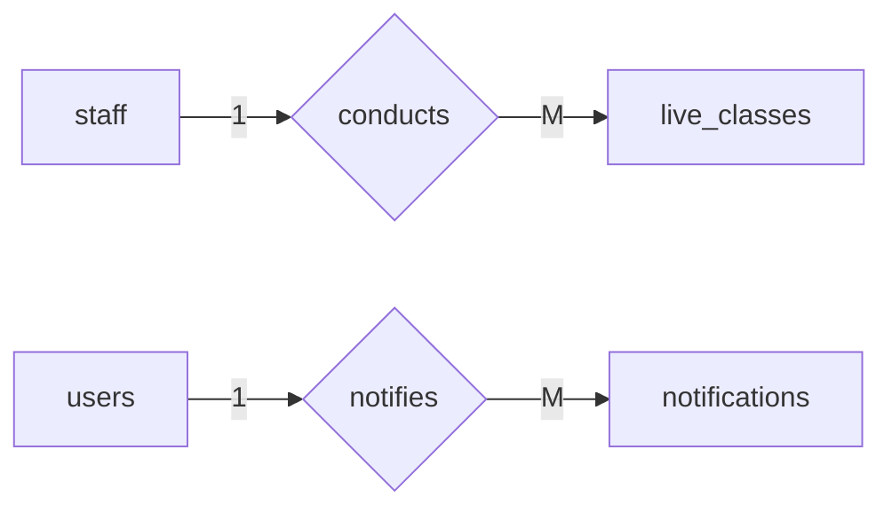
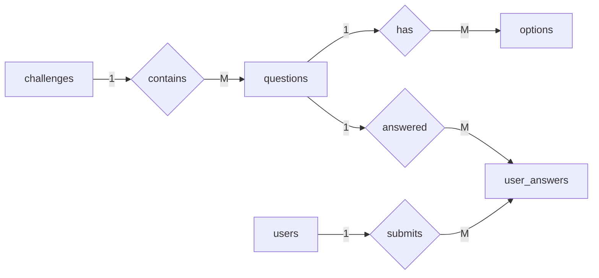
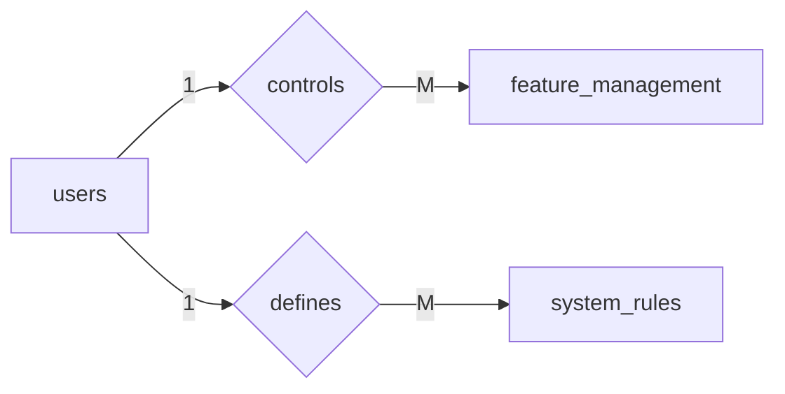

# Trading Platform Database ER Schema

This document describes the **complete ER structure of the Trading Learning Platform**.

The schema contains:

- **32 tables (entities)**
- **35 relationship diamonds**
- Modular system architecture

Notation used:

| Symbol | Meaning |
|------|------|
| 1 | one |
| M | many |
| ==> | total participation |
| --> | partial participation |

---

# System Architecture Overview

---

# 1. User Management Module

Entities

- roles
- users
- learners
- staff
- accounts
- audit_logs
- instructor_learner_mapping

---

# 2. Trading Module

---

# 3. Market Data Module

---

# 4. Learning Module

---

# 5. Live Education Module

---

# 6. Challenge Module

---

# 7. Platform Management Module

---

# FULL SYSTEM ER DIAGRAM

```mermaid
flowchart TB

%% ======================
%% ENTITIES
%% ======================

roles["roles<br>role_id PK"]
users["users<br>user_id PK<br>role_id FK"]

learners["learners<br>user_id PK FK"]
staff["staff<br>user_id PK FK"]

accounts["accounts<br>user_id FK"]

audit_logs["audit_logs<br>log_id PK<br>user_id FK"]

instructor_learner_mapping["instructor_learner_mapping<br>instructor_id FK<br>learner_id FK"]

instruments["instruments<br>instrument_id PK"]

market_prices["market_prices<br>instrument_id FK"]

market_depth["market_depth<br>depth_id PK<br>instrument_id FK"]
price_history["price_history<br>history_id PK<br>instrument_id FK"]

portfolio["portfolio<br>user_id FK<br>instrument_id FK"]

orders["orders<br>order_id PK<br>user_id FK<br>instrument_id FK"]
trades["trades<br>trade_id PK<br>order_id FK"]

transactions["transactions<br>transaction_id PK<br>user_id FK"]

watchlists["watchlists<br>watchlist_id PK<br>user_id FK"]
watchlist_items["watchlist_items<br>watchlist_id FK<br>instrument_id FK"]

indices["indices<br>index_id PK"]
index_constituents["index_constituents<br>index_id FK<br>instrument_id FK"]

financial_reports["financial_reports<br>report_id PK<br>instrument_id FK"]

courses["courses<br>course_id PK<br>provider_id FK"]
course_modules["course_modules<br>module_id PK<br>course_id FK"]
learning_materials["learning_materials<br>material_id PK<br>module_id FK"]

learning_progress["learning_progress<br>user_id FK"]

live_classes["live_classes<br>live_class_id PK<br>instructor_id FK"]
notifications["notifications<br>notification_id PK<br>user_id FK"]

challenges["challenges<br>challenge_id PK"]
questions["questions<br>question_id PK<br>challenge_id FK"]
options["options<br>option_id PK<br>question_id FK"]
user_answers["user_answers<br>user_id FK<br>question_id FK"]

feature_management["feature_management<br>user_id PK FK"]
system_rules["system_rules<br>rule_id PK<br>created_by FK"]

%% ======================
%% RELATIONSHIPS
%% ======================

assigns{assigns}
is_learner{is}
is_staff{is}
owns_account{owns}
logs_action{records}
mentors{mentors}

holds{holds}
places{places}
generates{generates}
records_transaction{records}
creates_watchlist{creates}
contains_item{contains}

updates_price{updates}
records_history{records}
provides_depth{provides}
contains_instrument{contains}
publishes_reports{publishes}

creates_course{creates}
contains_modules{contains}
contains_materials{contains}
tracks_progress{tracks}

conducts_class{conducts}
sends_notification{sends}

contains_questions{contains}
has_options{has}
records_answer{records}
submits_answer{submits}

controls_feature{controls}
defines_rules{defines}

%% ======================
%% CARDINALITY
%% ======================

roles -- "1" --> assigns
assigns -- "M" --> users

users -- "1" --> is_learner
is_learner -- "1" --> learners

users -- "1" --> is_staff
is_staff -- "1" --> staff

users -- "1" --> owns_account
owns_account -- "1" --> accounts

users -- "1" --> logs_action
logs_action -- "M" --> audit_logs

staff -- "1" --> mentors
learners -- "1" --> mentors
mentors -- "M" --> instructor_learner_mapping

users -- "1" --> holds
instruments -- "1" --> holds
holds -- "M" --> portfolio

users -- "1" --> places
places -- "M" --> orders

orders -- "1" --> generates
generates -- "M" --> trades

users -- "1" --> records_transaction
records_transaction -- "M" --> transactions

users -- "1" --> creates_watchlist
creates_watchlist -- "M" --> watchlists

watchlists -- "1" --> contains_item
instruments -- "1" --> contains_item
contains_item -- "M" --> watchlist_items

instruments -- "1" --> updates_price
updates_price -- "1" --> market_prices

instruments -- "1" --> records_history
records_history -- "M" --> price_history

instruments -- "1" --> provides_depth
provides_depth -- "M" --> market_depth

indices -- "1" --> contains_instrument
instruments -- "1" --> contains_instrument
contains_instrument -- "M" --> index_constituents

instruments -- "1" --> publishes_reports
publishes_reports -- "M" --> financial_reports

staff -- "1" --> creates_course
creates_course -- "M" --> courses

courses -- "1" --> contains_modules
contains_modules -- "M" --> course_modules

course_modules -- "1" --> contains_materials
contains_materials -- "M" --> learning_materials

users -- "1" --> tracks_progress
tracks_progress -- "M" --> learning_progress

staff -- "1" --> conducts_class
conducts_class -- "M" --> live_classes

users -- "1" --> sends_notification
sends_notification -- "M" --> notifications

challenges -- "1" --> contains_questions
contains_questions -- "M" --> questions

questions -- "1" --> has_options
has_options -- "M" --> options

questions -- "1" --> records_answer
records_answer -- "M" --> user_answers

users -- "1" --> submits_answer
submits_answer -- "M" --> user_answers

users -- "1" --> controls_feature
controls_feature -- "M" --> feature_management

users -- "1" --> defines_rules
defines_rules -- "M" --> system_rules


%% ======================
%% STYLING
%% ======================

classDef weakEntity stroke-width:4px;
classDef weakRel stroke-width:4px;

class accounts weakEntity
class market_prices weakEntity
class portfolio weakEntity
class watchlist_items weakEntity
class index_constituents weakEntity
class user_answers weakEntity
class instructor_learner_mapping weakEntity

class owns_account weakRel
class updates_price weakRel
class holds weakRel
class contains_item weakRel
class contains_instrument weakRel
class records_answer weakRel
class mentors weakRel
```

---

# ER Concepts Demonstrated

| Concept | Example |
|------|------|
1:1 relationship | users ↔ accounts |
1:M relationship | users → orders |
M:N relationship | indices ↔ instruments |
Weak entities | accounts, portfolio |
Associative entities | watchlist_items |
Specialization | users → learners/staff |
Composite associations | index_constituents |
Polymorphic tracking | learning_progress |
