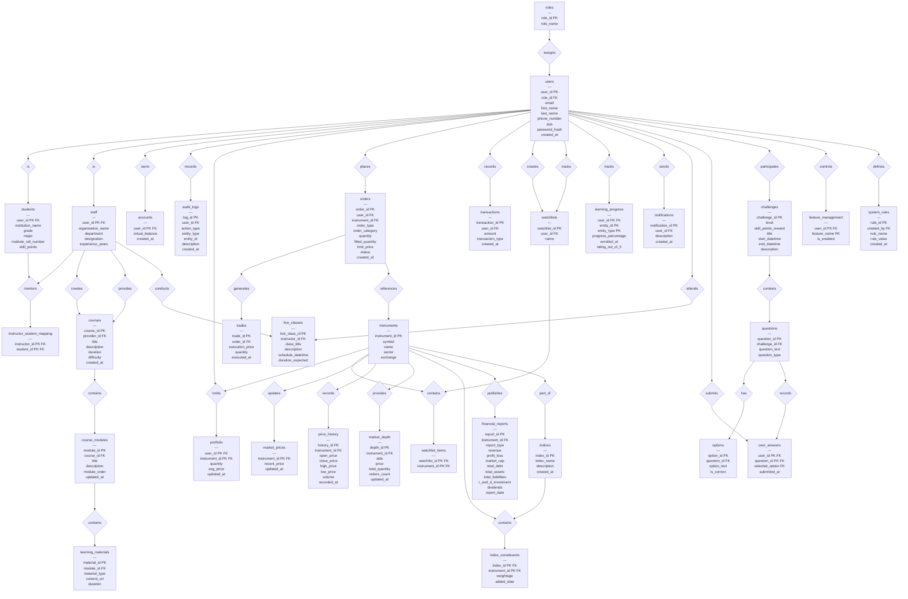

```mermaid
flowchart TB

%% ======================
%% ENTITIES WITH SEPARATOR
%% ======================

roles["roles<br>---<br>role_id PK<br>role_name"]

users["users<br>---<br>user_id PK<br>role_id FK<br>email<br>first_name<br>last_name<br>phone_number<br>dob<br>password_hash<br>created_at"]

students["students<br>---<br>user_id PK FK<br>institution_name<br>grade<br>major<br>institute_roll_number<br>skill_points"]

staff["staff<br>---<br>user_id PK FK<br>organisation_name<br>department<br>designation<br>experience_years"]

accounts["accounts<br>---<br>user_id PK FK<br>virtual_balance<br>created_at"]

audit_logs["audit_logs<br>---<br>log_id PK<br>user_id FK<br>action_type<br>entity_type<br>entity_id<br>description<br>created_at"]

instructor_student_mapping["instructor_student_mapping<br>---<br>instructor_id PK FK<br>student_id PK FK"]

instruments["instruments<br>---<br>instrument_id PK<br>symbol<br>name<br>sector<br>exchange"]

market_prices["market_prices<br>---<br>instrument_id PK FK<br>recent_price<br>updated_at"]

market_depth["market_depth<br>---<br>depth_id PK<br>instrument_id FK<br>side<br>price<br>total_quantity<br>orders_count<br>updated_at"]

price_history["price_history<br>---<br>history_id PK<br>instrument_id FK<br>open_price<br>close_price<br>high_price<br>low_price<br>volume<br>recorded_at"]

portfolio["portfolio<br>---<br>user_id PK FK<br>instrument_id PK FK<br>quantity<br>avg_price<br>updated_at"]

orders["orders<br>---<br>order_id PK<br>user_id FK<br>instrument_id FK<br>order_type<br>order_category<br>quantity<br>filled_quantity<br>limit_price<br>status<br>created_at"]

trades["trades<br>---<br>trade_id PK<br>order_id FK<br>execution_price<br>quantity<br>executed_at"]

transactions["transactions<br>---<br>transaction_id PK<br>user_id FK<br>amount<br>transaction_type<br>created_at"]

watchlists["watchlists<br>---<br>watchlist_id PK<br>user_id FK<br>name"]

watchlist_items["watchlist_items<br>---<br>watchlist_id PK FK<br>instrument_id PK FK"]

indices["indices<br>---<br>index_id PK<br>index_name<br>description<br>created_at"]

index_constituents["index_constituents<br>---<br>index_id PK FK<br>instrument_id PK FK<br>weightage<br>added_date"]

financial_reports["financial_reports<br>---<br>report_id PK<br>instrument_id FK<br>report_type<br>revenue<br>profit_loss<br>market_cap<br>total_debt<br>total_assets<br>total_liabilities<br>r_and_d_investment<br>dividends<br>report_date"]

courses["courses<br>---<br>course_id PK<br>provider_id FK<br>title<br>description<br>duration<br>difficulty<br>created_at"]

course_modules["course_modules<br>---<br>module_id PK<br>course_id FK<br>title<br>description<br>module_order<br>updated_at"]

learning_materials["learning_materials<br>---<br>material_id PK<br>module_id FK<br>material_type<br>content_url<br>duration"]

learning_progress["learning_progress<br>---<br>user_id PK FK<br>entity_id PK<br>entity_type PK<br>progress_percentage<br>enrolled_at<br>rating_out_of_5"]

live_classes["live_classes<br>---<br>live_class_id PK<br>instructor_id FK<br>class_title<br>description<br>schedule_datetime<br>duration_expected"]

notifications["notifications<br>---<br>notification_id PK<br>user_id FK<br>description<br>created_at"]

challenges["challenges<br>---<br>challenge_id PK<br>level<br>skill_points_reward<br>title<br>start_datetime<br>end_datetime<br>description"]

questions["questions<br>---<br>question_id PK<br>challenge_id FK<br>question_text<br>question_type"]

options["options<br>---<br>option_id PK<br>question_id FK<br>option_text<br>is_correct"]

user_answers["user_answers<br>---<br>user_id PK FK<br>question_id PK FK<br>selected_option FK<br>submitted_at"]

feature_management["feature_management<br>---<br>user_id PK FK<br>feature_name PK<br>is_enabled"]

system_rules["system_rules<br>---<br>rule_id PK<br>created_by FK<br>rule_name<br>rule_value<br>created_at"]


%% ======================
%% RELATIONSHIP DIAMONDS
%% ======================

assigns{assigns}
is_student{is}
is_staff{is}
owns_account{owns}
logs_action{records}
mentors{mentors}

holds{holds}
places{places}
generates{generates}
records_transaction{records}
creates_watchlist{creates}
contains_item{contains}
references_instrument{references}

updates_price{updates}
records_history{records}
provides_depth{provides}
contains_instrument{contains}
publishes_reports{publishes}
tracks_market{tracks}
part_of_index{part_of}

creates_course{creates}
contains_modules{contains}
contains_materials{contains}
tracks_progress{tracks}
provides_course{provides}

conducts_class{conducts}
sends_notification{sends}
attends_class{attends}

contains_questions{contains}
has_options{has}
records_answer{records}
submits_answer{submits}
participates{participates}

controls_feature{controls}
defines_rules{defines}


%% ======================
%% RELATIONSHIP EDGES
%% ======================

roles --> assigns --> users

users --> is_student --> students
users --> is_staff --> staff

users --> owns_account --> accounts
users --> logs_action --> audit_logs

staff --> mentors --> instructor_student_mapping
students --> mentors

users --> holds --> portfolio
instruments --> holds

users --> places --> orders
orders --> generates --> trades

users --> records_transaction --> transactions

users --> creates_watchlist --> watchlists
watchlists --> contains_item --> watchlist_items
instruments --> contains_item

orders --> references_instrument --> instruments

instruments --> updates_price --> market_prices
instruments --> records_history --> price_history
instruments --> provides_depth --> market_depth

indices --> contains_instrument --> index_constituents
instruments --> contains_instrument

instruments --> publishes_reports --> financial_reports

users --> tracks_market --> watchlists
instruments --> part_of_index --> indices

staff --> creates_course --> courses
courses --> contains_modules --> course_modules
course_modules --> contains_materials --> learning_materials

users --> tracks_progress --> learning_progress
staff --> provides_course --> courses

staff --> conducts_class --> live_classes
users --> sends_notification --> notifications
users --> attends_class --> live_classes

challenges --> contains_questions --> questions
questions --> has_options --> options

questions --> records_answer --> user_answers
users --> submits_answer --> user_answers

users --> participates --> challenges

users --> controls_feature --> feature_management
users --> defines_rules --> system_rules

```
