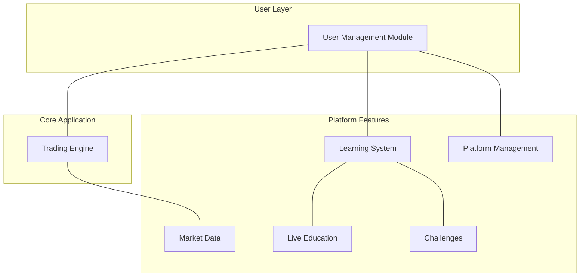
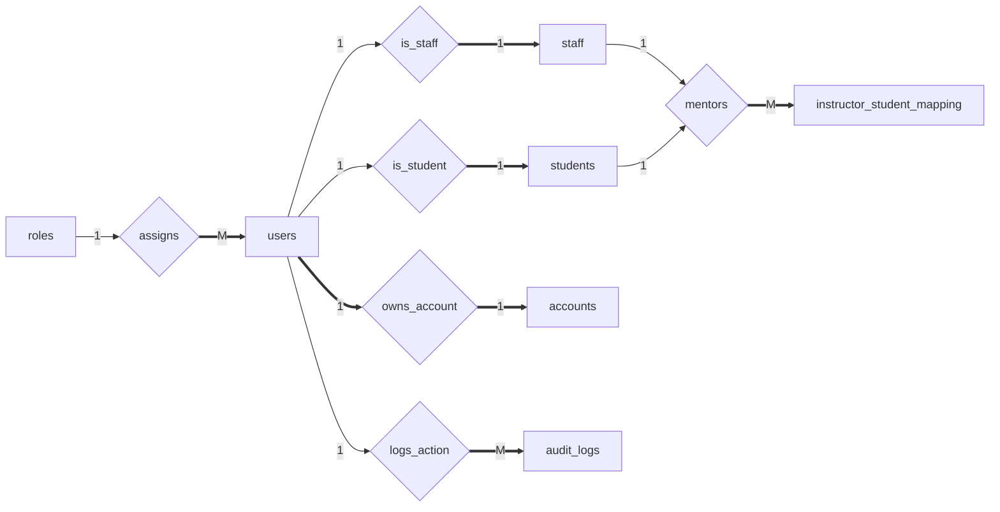
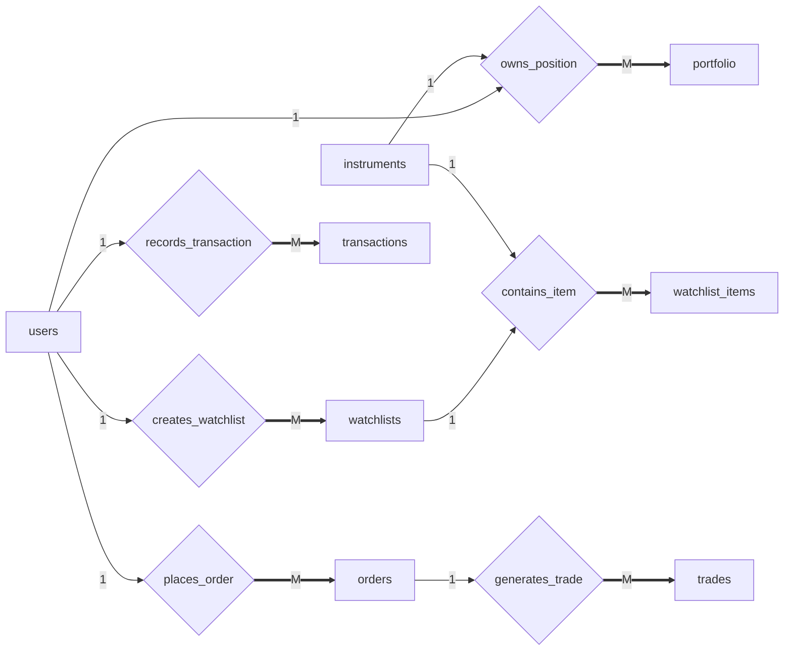
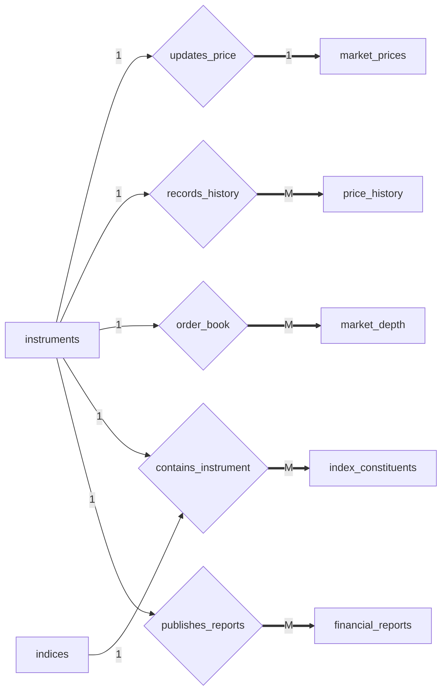
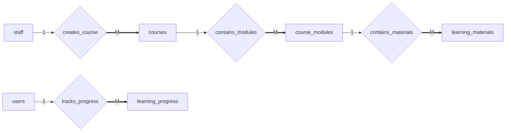
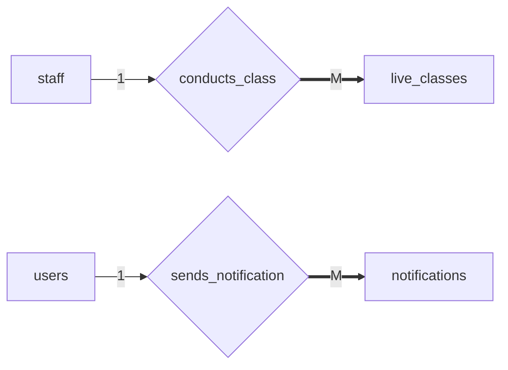
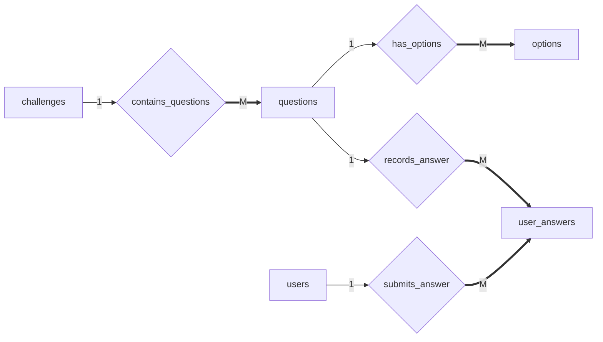
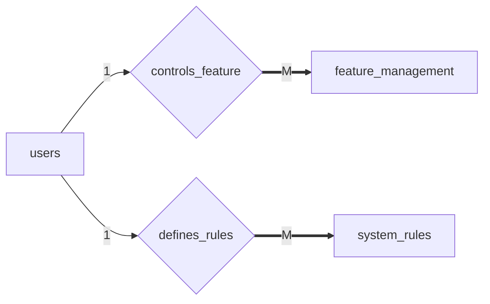
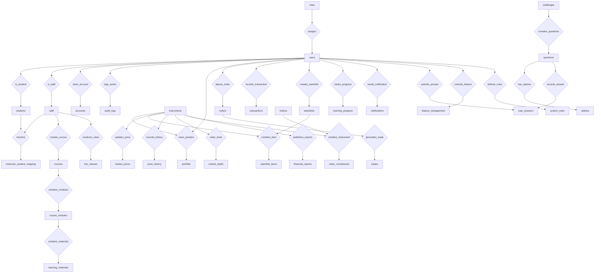

# Database Schema Structure

The database is divided into seven modules to keep the design modular and easy to understand.

# Database ER Diagrams

This document shows the entity-relationship structure of the platform database.

Notation used:

| Symbol | Meaning               |
| ------ | --------------------- |
| 1      | one                   |
| M      | many                  |
| ==>    | total participation   |
| -->    | partial participation |

---

# User Management Module

---

# Trading Module

---

# Market Data Module

---

# Learning Module

---

# Live Education Module

---

# Challenge Module

---

# Platform Management Module

---

# Full System ER Diagram

---

# ER Concepts Demonstrated

| Concept               | Example                             |
| --------------------- | ----------------------------------- |
| 1:1 relationship      | users ↔ accounts                    |
| 1:M relationship      | users → orders                      |
| M:N relationship      | users ↔ instruments (via portfolio) |
| Weak entities         | students, staff                     |
| Associative entities  | portfolio, watchlist_items          |
| Specialization        | users → students / staff            |
| Composite keys        | portfolio, watchlist_items          |
| Hierarchical learning | courses → modules → materials       |
