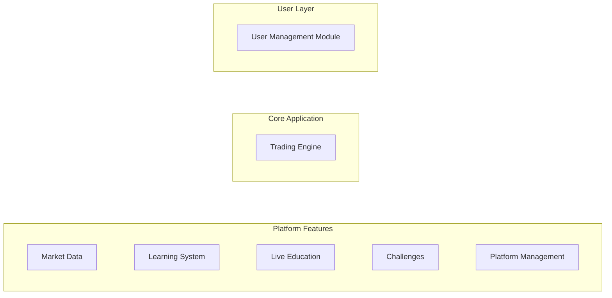
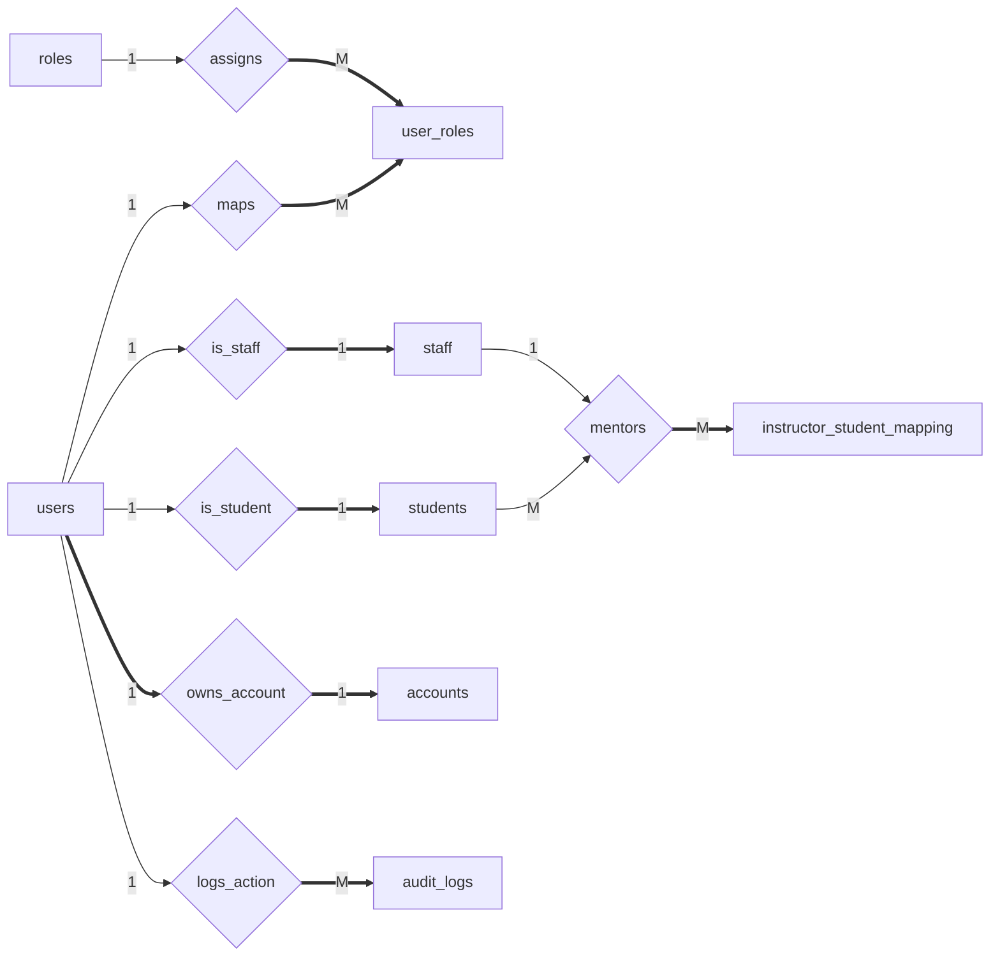
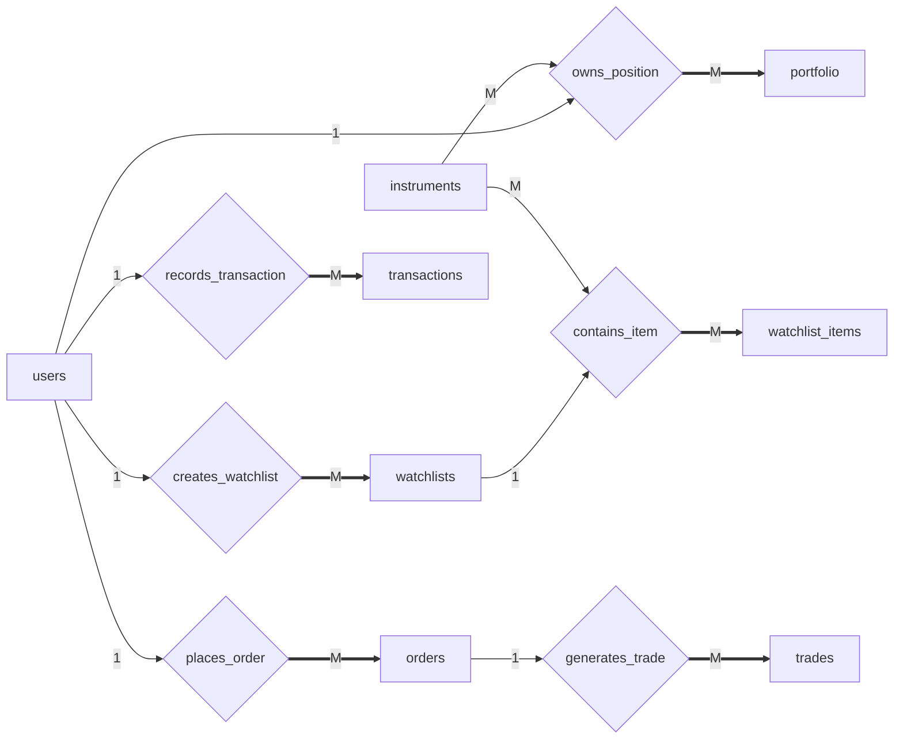
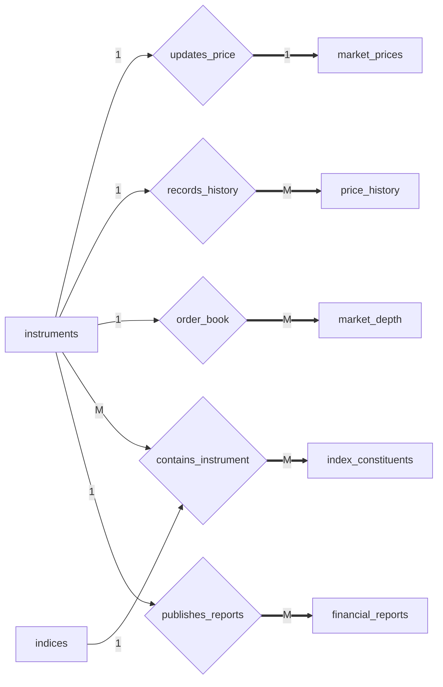
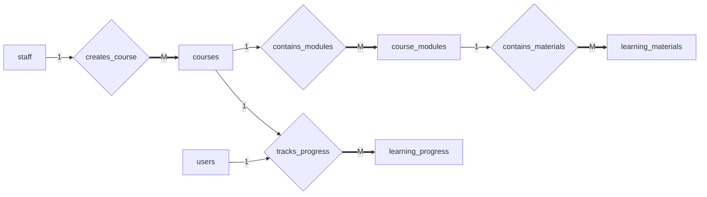
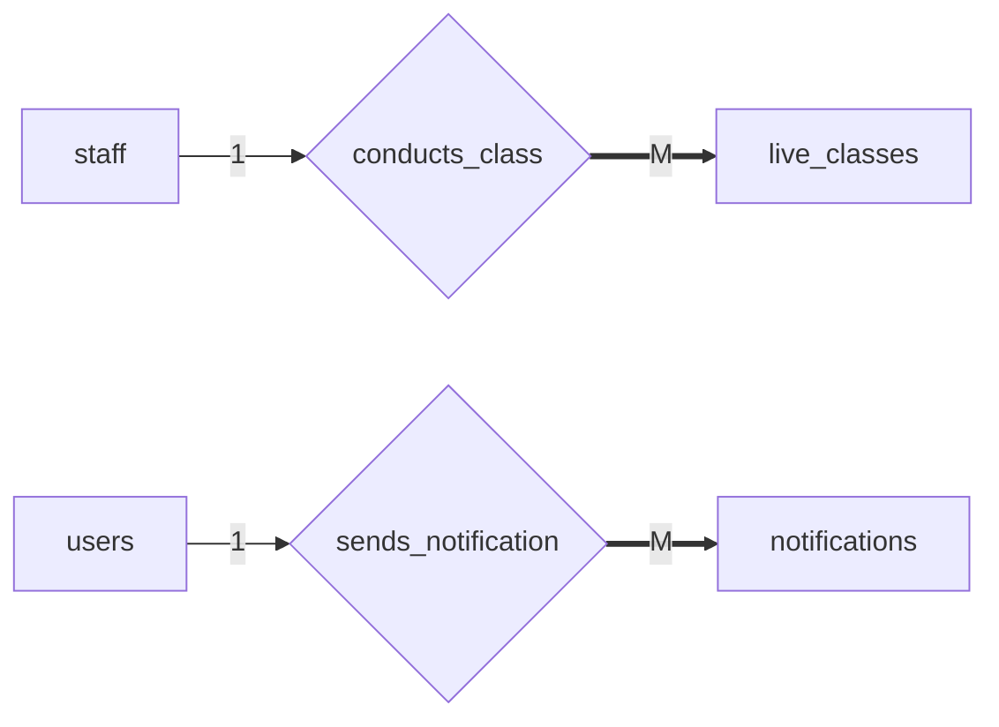
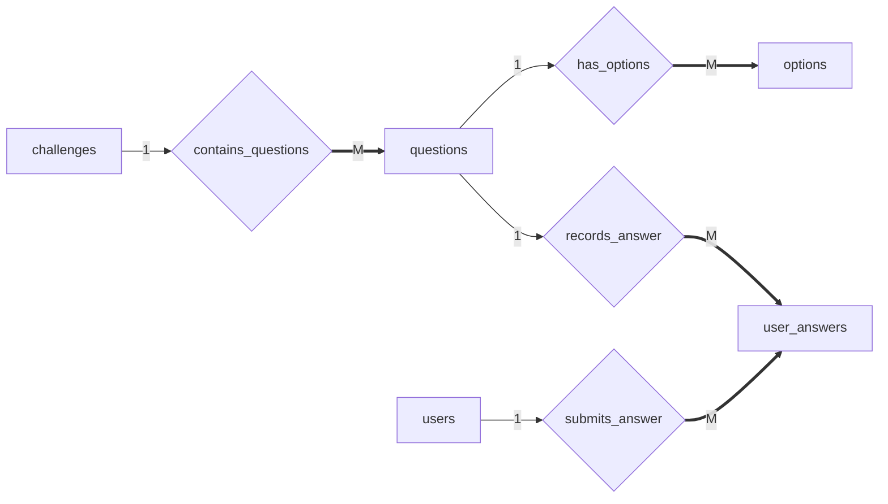
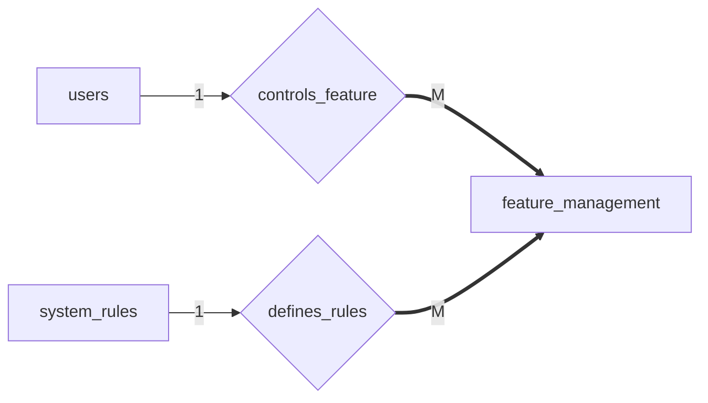
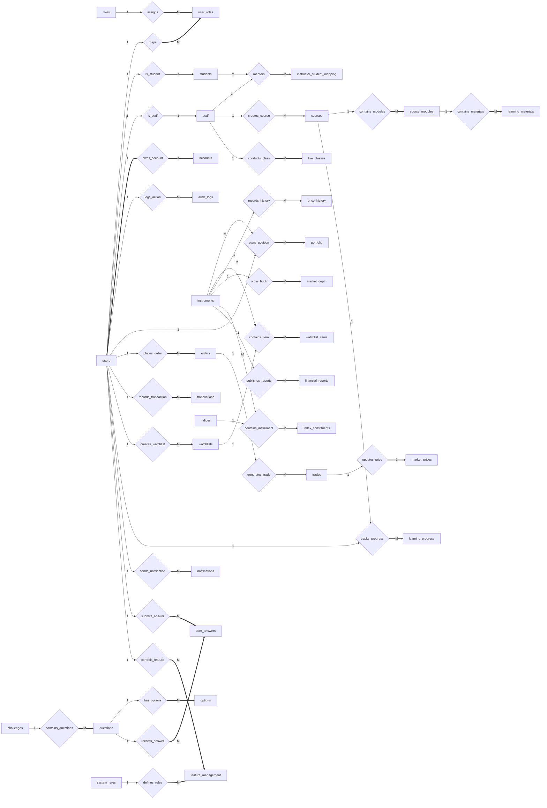
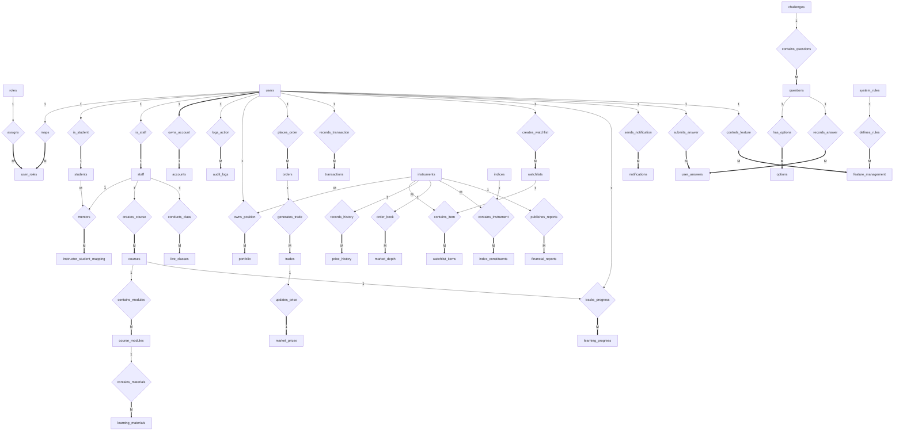

# Database Schema Structure

The database is divided into five modules to keep the design modular and easy to understand.

# Database ER Diagrams

This document shows the entity-relationship structure of the platform database.

Notation used:

| Symbol | Meaning |
|------|------|
1 | one |
M | many |
==> | total participation |
--> | partial participation |

---

# 1️⃣ User Management Module

---

# 2️⃣ Trading Module

---

# 3️⃣ Market Data Module

---

# 4️⃣ Learning Module

---

# 5️⃣ Live Education Module

---

# 6️⃣ Challenge Module

---

# 7️⃣ Platform Management Module

---

# Full System ER Diagram

# Full System ER Diagram (Improved Layout)

---

# ER Concepts Demonstrated

| Concept | Example |
|------|------|
1:1 relationship | users ↔ accounts |
1:M relationship | users → orders |
M:N relationship | users ↔ roles |
Weak entities | students, staff |
Associative entities | user_roles, portfolio |
Specialization | users → students/staff |
Composite keys | portfolio, watchlist_items |
Polymorphic relation | learning_progress |
