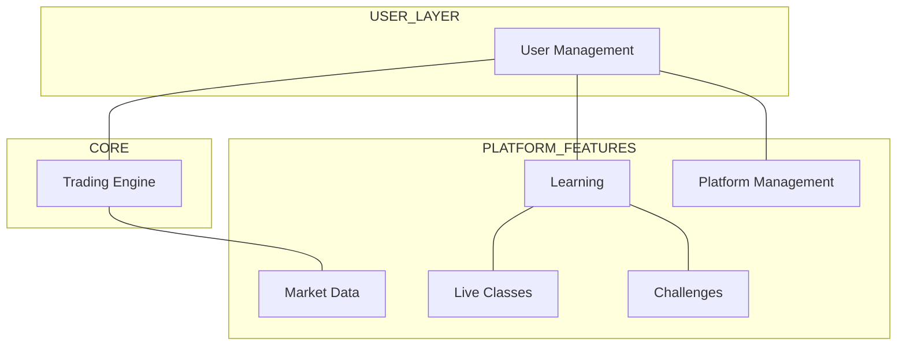
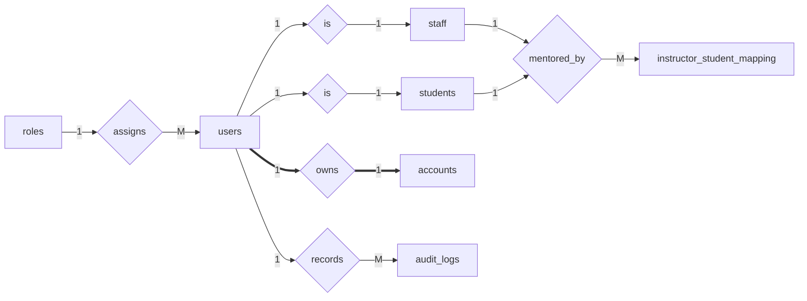
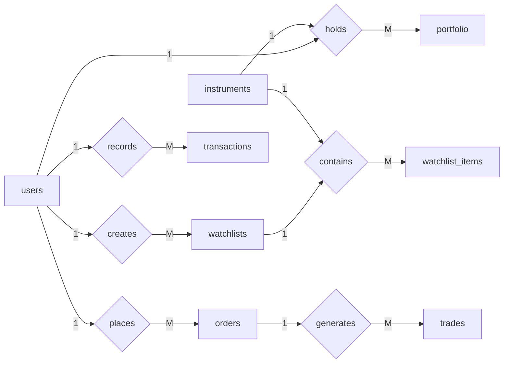
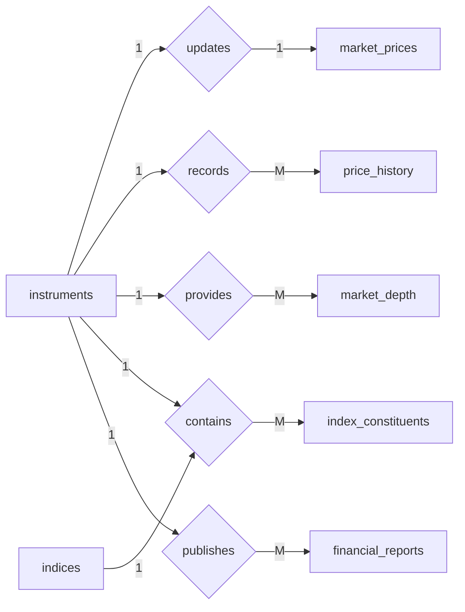
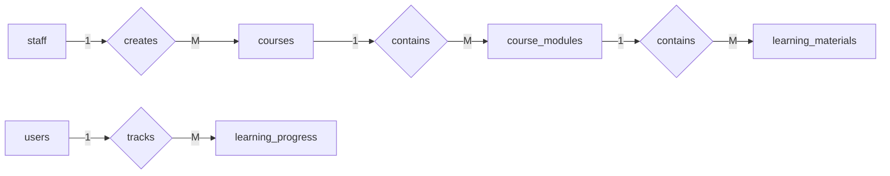
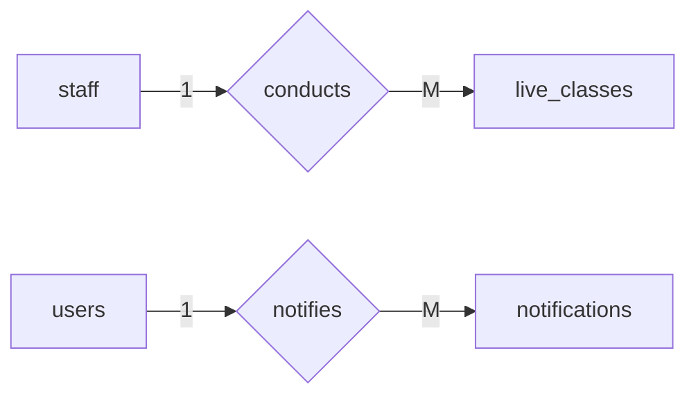
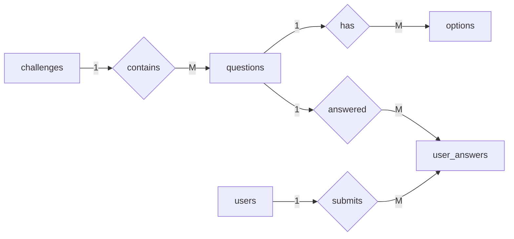
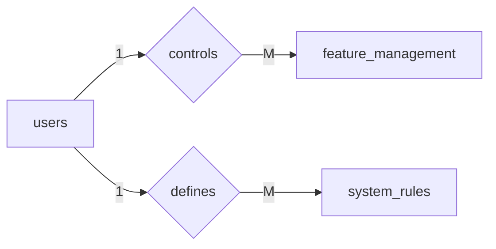

# Trading Platform Database ER Schema

This document describes the **complete ER structure of the Trading Learning Platform**.

The schema contains:

- **32 tables (entities)**
- **35 relationship diamonds**
- Multiple modules for clarity

Notation used:

| Symbol | Meaning |
|------|------|
| 1 | one |
| M | many |
| ==> | total participation |
| --> | partial participation |

---

# System Architecture Overview

---

# 1. User Management Module

Entities:

- roles
- users
- students
- staff
- accounts
- audit_logs
- instructor_student_mapping

---

# 2. Trading Module

Entities:

- instruments
- portfolio
- orders
- trades
- transactions
- watchlists
- watchlist_items

---

# 3. Market Data Module

Entities:

- market_prices
- market_depth
- price_history
- indices
- index_constituents
- financial_reports

---

# 4. Learning Module

Entities:

- courses
- course_modules
- learning_materials
- learning_progress

---

# 5. Live Education Module

Entities:

- live_classes
- notifications

---

# 6. Challenge Module

Entities:

- challenges
- questions
- options
- user_answers

---

# 7. Platform Management Module

Entities:

- feature_management
- system_rules

---

# FULL SYSTEM ER DIAGRAM

```mermaid
flowchart TB

%% ======================
%% ENTITIES (33 TABLES)
%% ======================

roles[roles]
users[users]
students[students]
staff[staff]
accounts[accounts]
audit_logs[audit_logs]
instructor_student_mapping[instructor_student_mapping]

instruments[instruments]
market_prices[market_prices]
market_depth[market_depth]
price_history[price_history]

portfolio[portfolio]
orders[orders]
trades[trades]
transactions[transactions]

watchlists[watchlists]
watchlist_items[watchlist_items]

indices[indices]
index_constituents[index_constituents]
financial_reports[financial_reports]

courses[courses]
course_modules[course_modules]
learning_materials[learning_materials]
learning_progress[learning_progress]

live_classes[live_classes]
notifications[notifications]

challenges[challenges]
questions[questions]
options[options]
user_answers[user_answers]

feature_management[feature_management]
system_rules[system_rules]


%% ======================
%% USER MANAGEMENT (6)
%% ======================

assigns{assigns}
is_student{is}
is_staff{is}
owns_account{owns}
logs_action{records}
mentors{mentors}

roles --> assigns
assigns --> users

users --> is_student
is_student --> students

users --> is_staff
is_staff --> staff

users --> owns_account
owns_account --> accounts

users --> logs_action
logs_action --> audit_logs

staff --> mentors
students --> mentors
mentors --> instructor_student_mapping


%% ======================
%% TRADING MODULE (7)
%% ======================

holds{holds}
places_order{places}
generates_trade{generates}
records_transaction{records}
creates_watchlist{creates}
contains_item{contains}
references_instrument{references}

users --> holds
instruments --> holds
holds --> portfolio

users --> places_order
places_order --> orders

orders --> generates_trade
generates_trade --> trades

users --> records_transaction
records_transaction --> transactions

users --> creates_watchlist
creates_watchlist --> watchlists

watchlists --> contains_item
instruments --> contains_item
contains_item --> watchlist_items

orders --> references_instrument
references_instrument --> instruments


%% ======================
%% MARKET DATA (7)
%% ======================

updates_price{updates}
records_history{records}
provides_depth{provides}
contains_instrument{contains}
publishes_reports{publishes}
tracks_market{tracks}
part_of_index{part_of}

instruments --> updates_price
updates_price --> market_prices

instruments --> records_history
records_history --> price_history

instruments --> provides_depth
provides_depth --> market_depth

indices --> contains_instrument
instruments --> contains_instrument
contains_instrument --> index_constituents

instruments --> publishes_reports
publishes_reports --> financial_reports

users --> tracks_market
tracks_market --> watchlists

instruments --> part_of_index
part_of_index --> indices


%% ======================
%% LEARNING MODULE (5)
%% ======================

creates_course{creates}
contains_modules{contains}
contains_materials{contains}
tracks_progress{tracks}
provides_course{provides}

staff --> creates_course
creates_course --> courses

courses --> contains_modules
contains_modules --> course_modules

course_modules --> contains_materials
contains_materials --> learning_materials

users --> tracks_progress
tracks_progress --> learning_progress

staff --> provides_course
provides_course --> courses


%% ======================
%% LIVE EDUCATION (3)
%% ======================

conducts_class{conducts}
sends_notification{sends}
attends_class{attends}

staff --> conducts_class
conducts_class --> live_classes

users --> sends_notification
sends_notification --> notifications

users --> attends_class
attends_class --> live_classes


%% ======================
%% CHALLENGE MODULE (5)
%% ======================

contains_questions{contains}
has_options{has}
records_answer{records}
submits_answer{submits}
participates{participates}

challenges --> contains_questions
contains_questions --> questions

questions --> has_options
has_options --> options

questions --> records_answer
records_answer --> user_answers

users --> submits_answer
submits_answer --> user_answers

users --> participates
participates --> challenges


%% ======================
%% PLATFORM MANAGEMENT (2)
%% ======================

controls_feature{controls}
defines_rules{defines}

users --> controls_feature
controls_feature --> feature_management

users --> defines_rules
defines_rules --> system_rules
```

---

# ER Concepts Demonstrated

| Concept | Example |
|------|------|
1:1 relationship | users ↔ accounts |
1:M relationship | users → orders |
M:N relationship | users ↔ roles |
Weak entities | students, staff |
Associative entities | user_roles, portfolio |
Specialization | users → students/staff |
Composite keys | portfolio, watchlist_items |
Polymorphic relation | learning_progress ||
