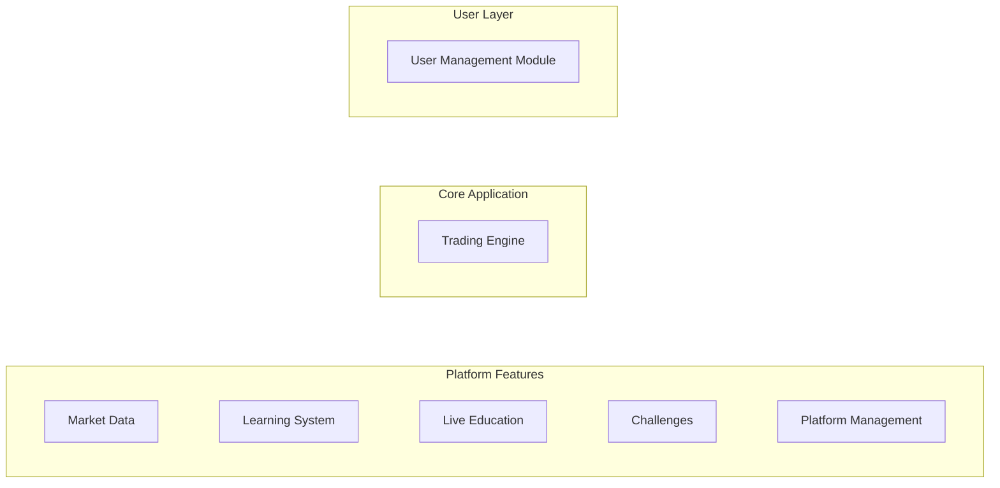
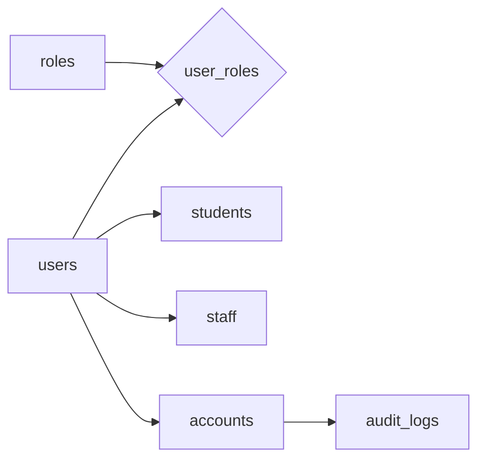
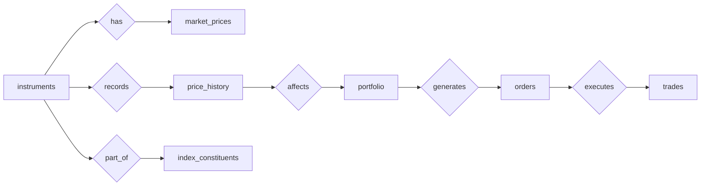
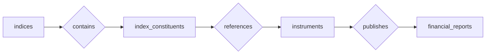
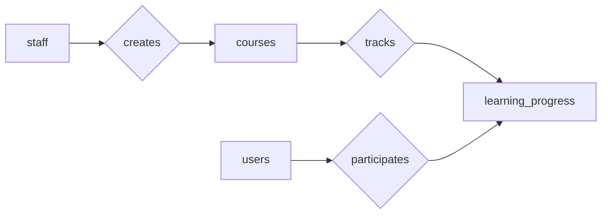
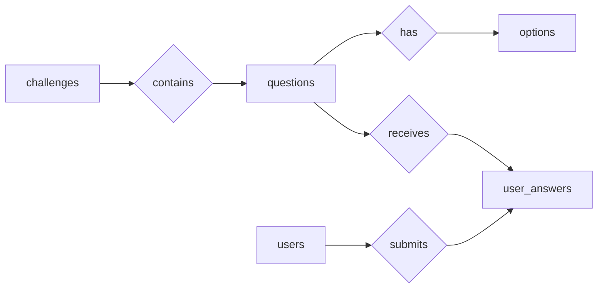

# Database Schema Structure

The database is divided into five modules to keep the design modular and easy to understand.

# System Modules Schema

## 1️⃣ User Module

**Description:**  
Handles authentication, user roles, and profile management. It also maintains account information and audit logs for security and traceability.

---

## 2️⃣ Trading Module

**Description:**  
Manages trading activities including instruments, price tracking, portfolios, and execution of orders and trades.

---

## 3️⃣ Market Data Module

**Description:**  
Stores financial market reference data such as indices, instrument composition, and company financial reports used for analysis and trading.

---

## 4️⃣ Learning Module

**Description:**  
Provides educational resources and tracks user learning progress through courses managed by staff.

---

## 5️⃣ Challenge Module

**Description:**  
Implements practice challenges and quizzes to test users’ knowledge, storing questions, options, and submitted answers.

---

