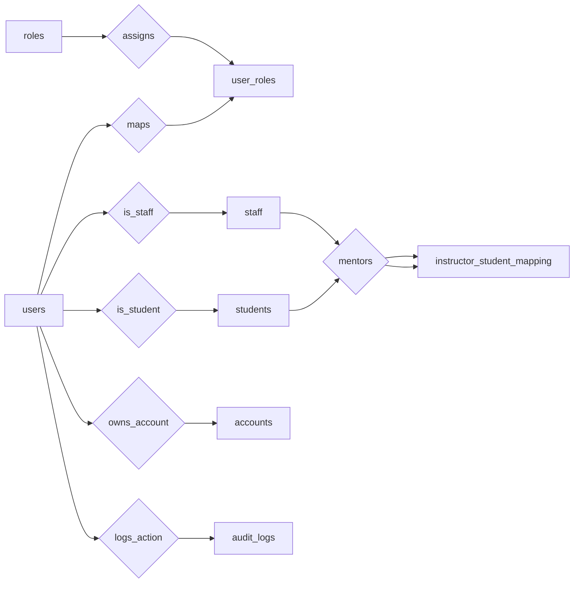
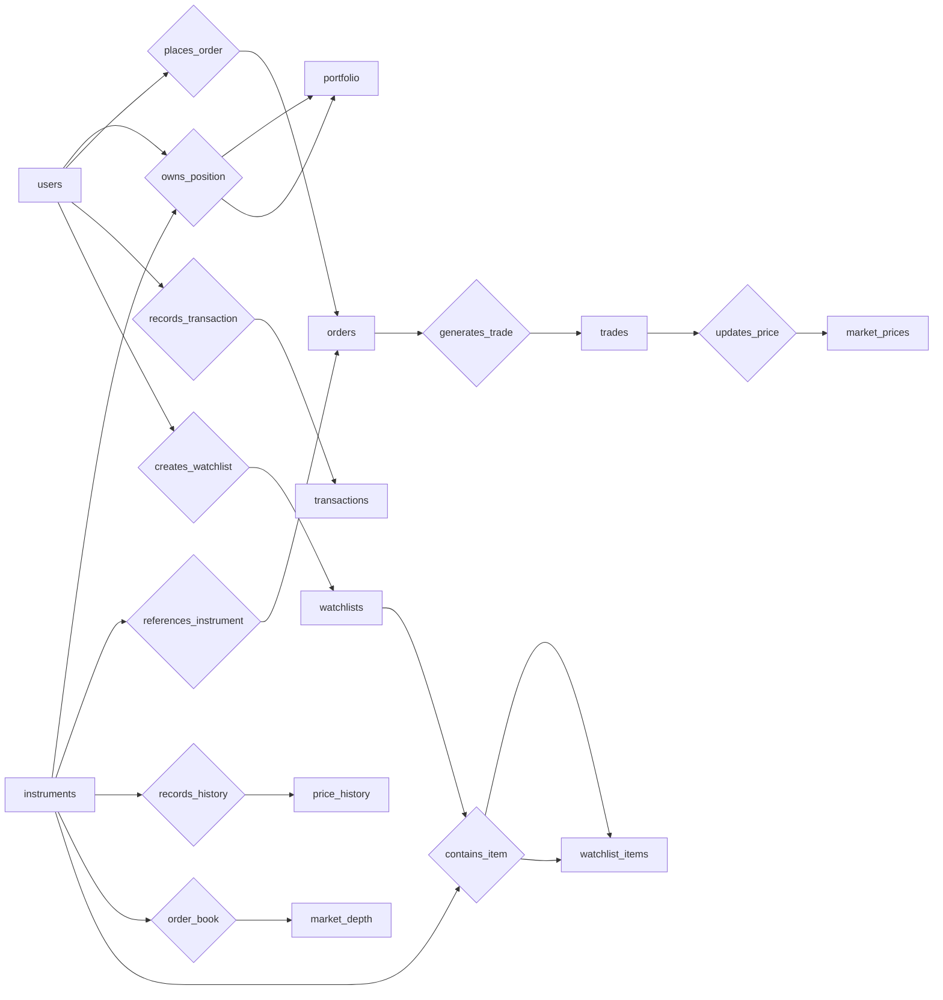
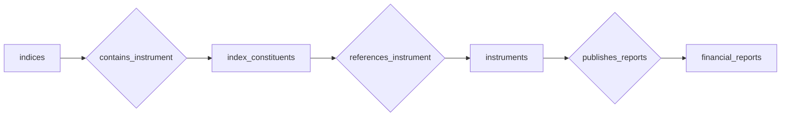
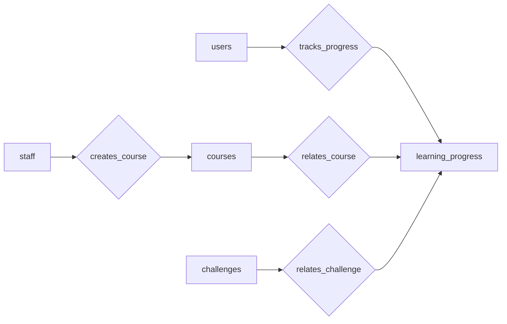
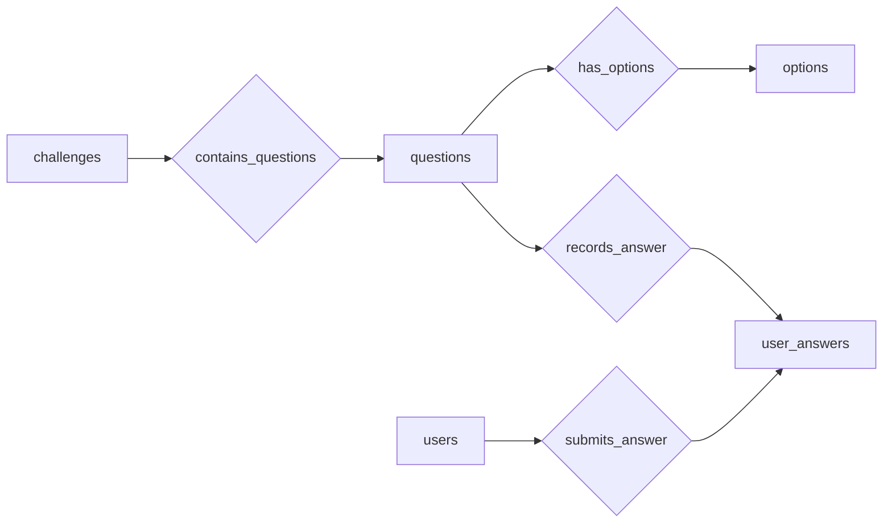
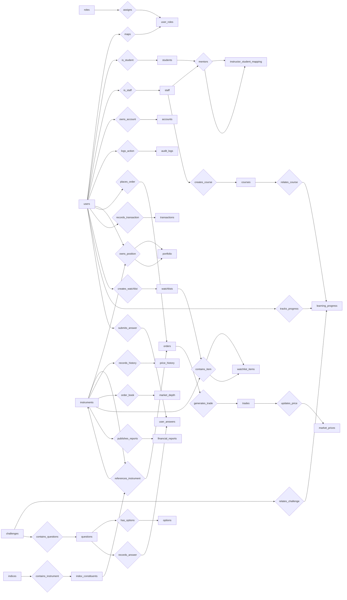

# Database Schema Overview  
Education-Oriented Financial Literacy & Paper Trading Platform

This document describes the database schema used in the project.  
The schema is divided into logical modules so the system design is easy to understand.

Modules:

1. User Management Module  
2. Trading Module  
3. Market Data Module  
4. Learning Module  
5. Challenge Module  

At the end of the document a **full system ER diagram** is provided.

---

# 1️⃣ User Management Module

## Description
Handles authentication, authorization, and user profile management.  
This module also stores account information and audit logs to track important system actions.

## Tables

roles  
users  
user_roles  
students  
staff  
accounts  
audit_logs  
instructor_student_mapping  

---

## User Module ER Diagram

---

# 2️⃣ Trading Module

## Description
Manages simulated stock trading operations including instruments, portfolios, order placement, trade execution, and user watchlists.

## Tables

instruments  
market_prices  
price_history  
market_depth  
portfolio  
orders  
trades  
transactions  
watchlists  
watchlist_items  

---

## Trading Module ER Diagram

---

# 3️⃣ Market Data Module

## Description
Stores financial reference data used for market analysis and trading decisions.

## Tables

indices  
index_constituents  
financial_reports  

---

## Market Data ER Diagram

---

# 4️⃣ Learning Module

## Description
Provides financial education through courses and tracks learning progress of users across courses and challenges.

## Tables

courses  
learning_progress  

---

## Learning Module ER Diagram

---

# 5️⃣ Challenge Module

## Description
Provides quizzes and challenges to test users' financial knowledge.

## Tables

challenges  
questions  
options  
user_answers  

---

## Challenge Module ER Diagram

---

# 6️⃣ Full System ER Diagram

---

# Summary

The database schema supports:

• user management and authentication  
• simulated trading with full order lifecycle  
• watchlists for tracking instruments  
• market data storage and analysis  
• financial education through structured courses  
• knowledge testing through quizzes and challenges  

The modular structure ensures the system remains scalable, maintainable, and easy to understand.
